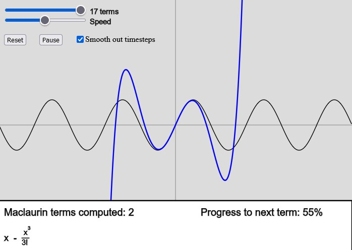
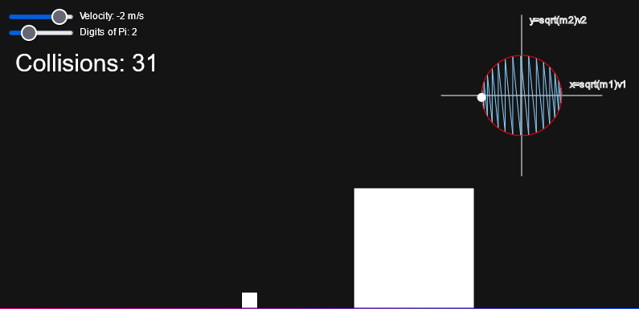
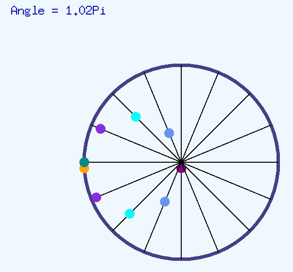

# Beautiful Mathematica

This repo will include a set mathematical visualizations inspired by my IB Math AA HL class. Special thank you to Mr. Betancourt and Dr. Perez! All simulations are available either in the following links or in 'builds.'

## Maclaurin Series Visualization
The Maclaurin Series is simply beautiful, but that beauty isn't exactly conveyed by "fUnCtiOns cAn bE ExPresSed aS a PolyNoMiaL." This progressive visualization of the Maclaurin series for the sine function may just be a bit more... breathtaking. Would love to make it more 'smooth' with a continuous function for a series with partial terms.

  

### How to use?
* Check it out at https://editor.p5js.org/stasostyk/full/YoOKDulVA

## Calculating Pi with collisions
Using perfectly elastic collisions, you can calculate the digits of π. The mathematical reason for this
is visually demonstrated in the top right with the momentum of both objects plotted against each other. For a detailed explanation, [3B1B explains this quite well (using trigonometry!)](https://youtu.be/jsYwFizhncE)

  

### How to use?
* Just go to https://stasostyk.github.io/beautiful-mathematica/pi/ (or better, check it out at https://phisics.tech/dynamics/pi/)

## Trigonometry
Trig really has nothing to do with triangles... its all just circles. Here is one demo of the circular illusions brought upon Sine manipulation. The orange ball travels around the purple perimeter, while all the other balls travel on their own axis. Due to the impressive relationship in Sine functions, despite all balls moving back and forth, they form a rotating circle.

  

### How to use?
* download and double click on "trig.exe" in "builds"
* left click to make the axis visible
* right click to add moving balls
